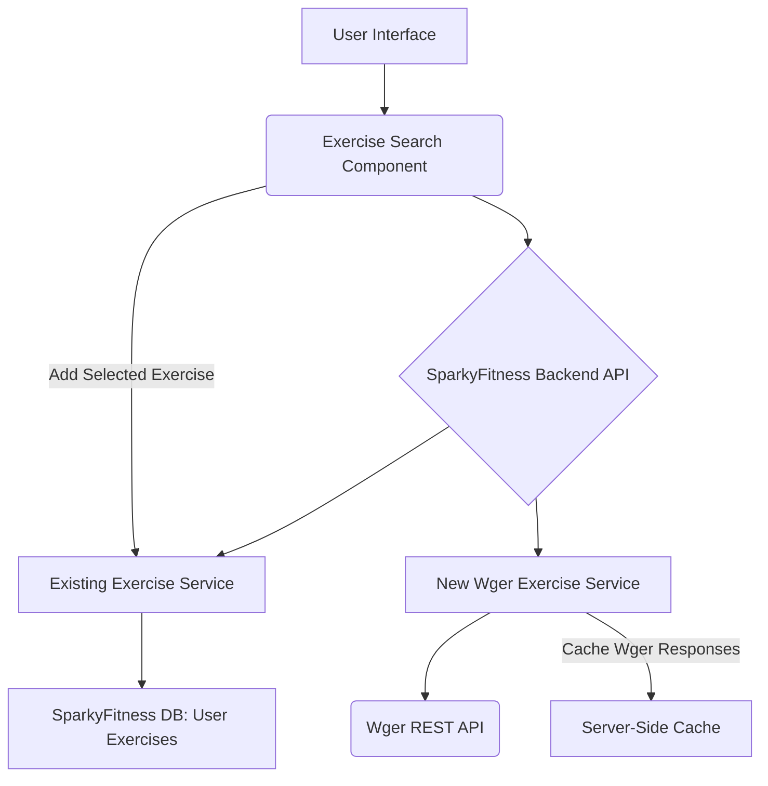

# Wger Exercise Database Integration Plan

## 1. Introduction

This document outlines the plan for integrating the `wger` exercise database into the SparkyFitness application. The goal is to provide users with the ability to search for exercises from a comprehensive external database and add them to their personal exercise catalog, similar to how food data providers are integrated.

## 2. Chosen Approach: Direct Wger API Integration

After evaluating several options, direct integration with the `wger` REST API is the chosen approach due to its API-driven nature, potential for calorie information, rich data, and maintainability. This avoids the complexities of importing static data files and managing local copies of a large external database.

## 3. Architecture

The integration will involve modifications to the backend services, API routes, and frontend components.

**Explanation of Components:**

*   **User Interface**: The user interacts with an enhanced Exercise Search Component.
*   **Exercise Search Component**: This component will query the SparkyFitness Backend API for exercise search results.
*   **SparkyFitness Backend API**: This acts as a central point, routing requests to the appropriate services. It will handle authentication and authorization.
*   **Existing Exercise Service**: Handles operations related to exercises already in the user's personal database (`public.exercises` table).
*   **New Wger Exercise Service**: This service will be responsible for:
    *   Making API calls to the `wger` REST API.
    *   Handling search queries and fetching detailed exercise information.
    *   Implementing server-side caching for `wger` API responses to improve performance and reduce redundant external calls.
    *   Mapping `wger` data to SparkyFitness's `public.exercises` schema.
*   **Wger REST API**: The external source of exercise data (`https://wger.de/api/v2/`).
*   **Server-Side Cache**: A mechanism (e.g., Redis, in-memory cache) to store `wger` API responses temporarily.
*   **SparkyFitness DB: User Exercises**: The existing `public.exercises` table, which will store user-specific exercises, including those imported from `wger`.

## 4. Data Flow and Logic

### 4.1. Exercise Search

1.  User types a search query in the frontend Exercise Search Component.
2.  The frontend sends the query to a new backend API endpoint (e.g., `/api/exercises/search-external`).
3.  The backend endpoint calls the `New Wger Exercise Service`.
4.  The `New Wger Exercise Service` queries the `wger` API (checking cache first).
5.  `wger` API returns exercise search results.
6.  The `New Wger Exercise Service` processes the results, potentially filtering or reformatting them.
7.  The backend API combines results from `wger` and potentially existing user exercises.
8.  Results are returned to the frontend for display.

### 4.2. Adding a Wger Exercise to User's Catalog

1.  User selects a `wger` exercise from the search results and clicks "Add".
2.  The frontend sends a request to an existing or new backend API endpoint (e.g., `/api/exercises/add-external`).
3.  The backend endpoint calls the `Existing Exercise Service` (or a dedicated function within it).
4.  The `Existing Exercise Service` retrieves the full details of the selected `wger` exercise from the `New Wger Exercise Service` (which may involve another `wger` API call or cache lookup).
5.  The `Existing Exercise Service` maps the `wger` exercise data to the `public.exercises` table schema.

    *   `name`: Mapped directly from `wger.name`.
    *   `category`: Mapped from `wger.category` (or a suitable default/derived category).
    *   `description`: Mapped from `wger.description` or a summary of `wger.instructions`.
    *   `is_custom`: Set to `TRUE`.
    *   `user_id`: Extracted from the authenticated JWT.
    *   `source_external_id`: A new column in `public.exercises` will store the `wger` exercise's unique ID. This will be a `TEXT` field.
    *   `calories_per_hour`: Calculated using `wger`'s MET value.

### 4.3. Calories Per Hour Calculation

The `wger` API provides a `met` (Metabolic Equivalent of Task) value for exercises. The `calories_per_hour` will be calculated using the following formula:

`Calories Burned per Minute = (METs * 3.5 * Body Weight in kg) / 200`
`Calories Burned per Hour = Calories Burned per Minute * 60`

**Body Weight Source Priority:**

1.  **User's Latest Check-in Weight**: The system will attempt to retrieve the user's most recent weight from the `public.check_in_measurements` table.
2.  **Standard Average Body Weight**: If the user has no recorded check-in weight, a standard average body weight (e.g., 70 kg or 154 lbs) will be used as a fallback.

## 5. Security Considerations

*   **Authentication**: All new backend API endpoints will be protected by JWT authentication. The `user_id` will always be extracted from the authenticated token and will **not** be passed directly as a parameter in requests.
*   **Authorization**: Ensure that only authenticated users can add exercises to their catalog.

## 6. Refactoring Existing Data Providers

To generalize the concept of external data sources, the existing `food_data_providers` will be refactored.

*   **Renaming**: The `food_data_providers` table, related files, and code references will be renamed to a more generic term, such as `external_data_providers` or `api_integrations`.
*   **Scope**: This refactoring will encompass both backend and frontend codebases to ensure consistency.
*   **Impact**: This change will allow the system to manage various types of external data providers (food, exercise, etc.) under a unified structure.

## 7. UI/UX Considerations

*   The frontend exercise search component will be enhanced to display results from both existing user exercises and `wger` exercises.
*   The UI will follow existing patterns, particularly those established by the food search and add components (e.g., `EnhancedFoodSearch.tsx`), to ensure a consistent and intuitive user experience.

## 8. Implementation Steps (High-Level)

1.  Create `docs/wger-integration-plan.md` (this document).
2.  Analyze existing food provider architecture for generalization.
3.  Plan refactoring of `food_data_providers` to a generic name.
4.  Execute refactoring of data providers (rename tables, files, update code).
5.  Add `source_external_id` column to `public.exercises` table.
6.  Implement new backend service to interact with the `wger` API (search, fetch details, caching).
7.  Create new API endpoint for `wger` exercise search (ensuring JWT for user_id).
8.  Enhance frontend exercise search component (to query both existing and `wger` exercises).
9.  Implement logic to add `wger` exercise to user's `public.exercises` table (mapping fields including calories, using user's latest weight or average if not available).
10. Test end-to-end functionality.
